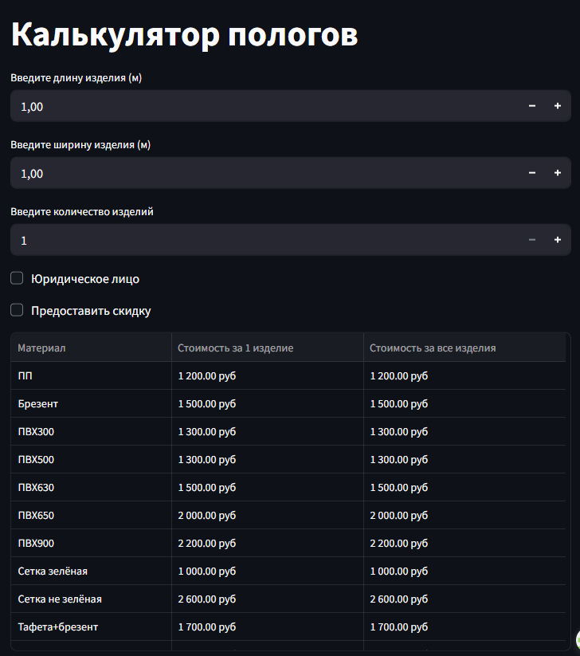
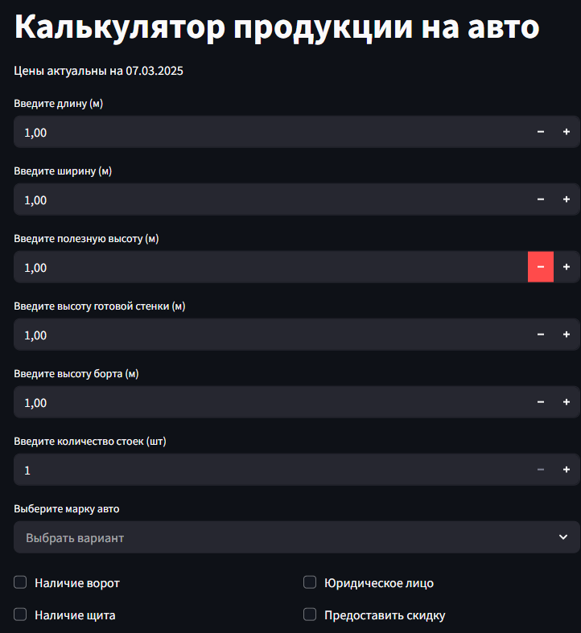
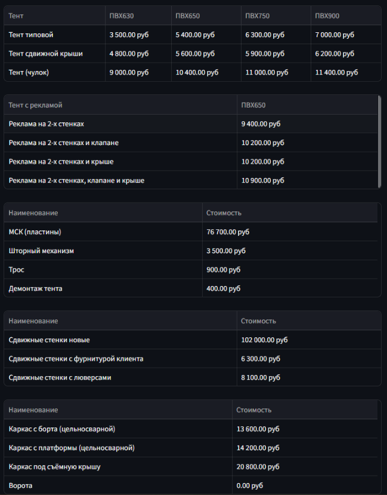

# Калькуляторы для расчёта стоимости продукции

 *(Опционально: замените на ваш логотип)*

Этот проект представляет собой веб-приложение, созданное с помощью Streamlit, которое содержит несколько калькуляторов для расчёта стоимости различных видов продукции: пологов, автомобильных тентов и сопутствующих изделий.

## 📸 Скриншоты интерфейса

### 1. Калькулятор пологов
  
*Расчёт стоимости пологов с выбором материалов и параметров*

### 2. Калькулятор авто
  
*Интерфейс расчёта автомобильных тентов с дополнительными опциями*

### 3. Таблицы результатов
  
*Форматированный вывод результатов в табличном виде*

## 🛠️ Функционал приложения

Приложение состоит из трёх основных страниц:

1. **Калькулятор пологов**:
   - Расчёт стоимости пологов из различных материалов (ПП, брезент, ПВХ разных марок и др.)
   - Учёт дополнительных параметров: размеры, количество, юридическое лицо, скидки
   - Отображение результатов в удобной таблице с форматированными ценами

2. **Калькулятор авто**:
   - Расчёт стоимости автомобильных тентов и сопутствующих изделий
   - Поддержка различных типов тентов (типовой, сдвижная крыша, "чулок")
   - Расчёт стоимости рекламных тентов с разными вариантами размещения
   - Дополнительные расчёты: МСК, шторный механизм, трос, демонтаж
   - Расчёт стоимости каркасов и сдвижных стенок
   - Учёт марки автомобиля (Газель/Иное) и других параметров

3. **Ещё калькулятор** (заглушка):
   - Страница для будущих дополнений

## ⚙️ Технологии

- Python 3
- Streamlit (для создания веб-интерфейса)
- Pandas (для работы с табличными данными)
- Math (для математических вычислений)

## 🚀 Установка и запуск

1. Убедитесь, что у вас установлен Python 3.x
2. Установите необходимые зависимости:
   ```bash
   pip install streamlit pandas
   ``
