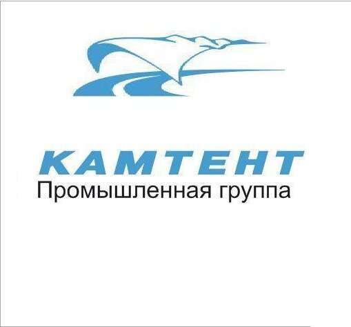
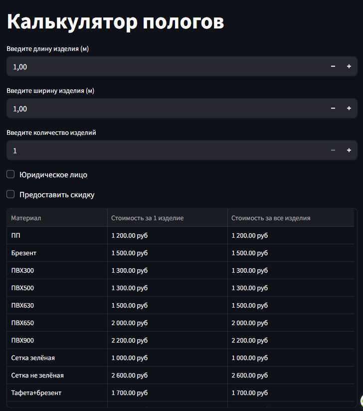
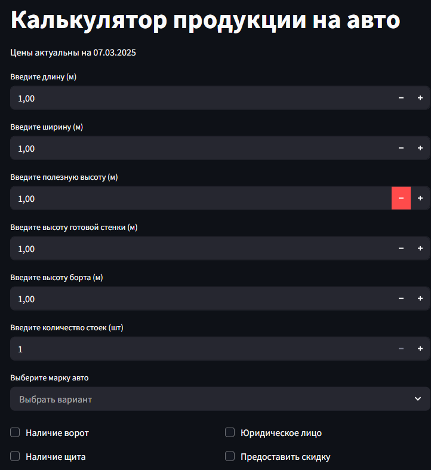
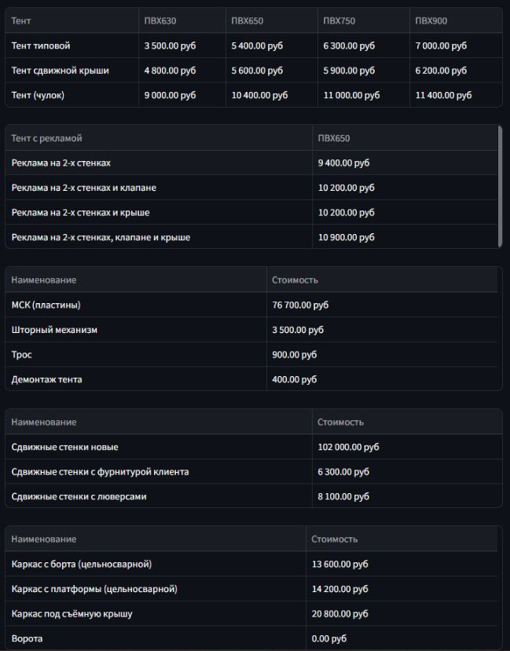

# Калькуляторы для расчёта стоимости продукции



Этот проект представляет собой веб-приложение, созданное с помощью Streamlit, которое содержит несколько калькуляторов для расчёта стоимости различных видов продукции: пологов, автомобильных тентов и сопутствующих изделий.

[](https://python.org)
[](https://streamlit.io)
[](https://pandas.pydata.org)
[](https://github.com/denisalkulikov/kamtent_streamlit/blob/master/LICENSE)

[](https://github.com/denisalkulikov/kamtent_streamlit/releases)
---

## 📸 Скриншоты интерфейса

### 1. Калькулятор пологов
  
*Расчёт стоимости пологов с выбором материалов и параметров*

### 2. Калькулятор авто
  
*Интерфейс расчёта автомобильных тентов с дополнительными опциями*

### 3. Таблицы результатов
  
*Форматированный вывод результатов в табличном виде*

---

## 🔐 Авторизация

Приложение защищено паролем. Для доступа к функционалу необходимо пройти авторизацию:

- Логин и пароль настраиваются в файле `.streamlit/secrets.toml`
- Данные для входа предоставляются администратором

---

## 🛠️ Функционал приложения

Приложение состоит из трёх основных страниц:

### 1. Калькулятор пологов

Расчёт стоимости пологов с возможностью выбора:
- **Длины и ширины изделия** (в метрах)
- **Количества изделий**
- **Материала** (ПП, брезент, ПВХ300, ПВХ500, ПВХ630, ПВХ650, ПВХ900, сетка зелёная, сетка не зелёная, тафета+брезент, плёнка, тафета+оксфорд, оксфорд)
- **Скидки** (в процентах)

### 2. Калькулятор авто

Расчёт стоимости автомобильных тентов и сопутствующих изделий:

**Основные параметры:**
- Длина, ширина, полезная высота, высота готовой стенки, высота борта
- Количество стоек
- Марка автомобиля (Газель / Иное)
- Наличие ворот и щита

**Типы тентов:**
- Тент типовой
- Тент сдвижной крыши
- Тент (чулок)

**Тенты с рекламой:**
- Реклама на 2-х стенках
- Реклама на 2-х стенках и клапане
- Реклама на 2-х стенках и крыше
- Реклама на 2-х стенках, клапане и крыше

**Дополнительные компоненты:**
- МСК (пластины) – механизм сдвижной крыши
- Шторный механизм
- Трос
- Демонтаж тента
- Ворота (с учётом марки автомобиля и высоты)

**Сдвижные стенки:**
- Новые сдвижные стенки
- Сдвижные стенки с фурнитурой клиента
- Сдвижные стенки с люверсами

**Каркасы:**
- Каркас с борта (цельносварной)
- Каркас с платформы (цельносварной)
- Каркас под съёмную крышу

>Все коэффициенты вынесены в отдельный конфигурационный файл

### 3. Ещё калькулятор

Страница-заглушка для будущих дополнений.

---

## ⚙️ Технологии

- **Python 3.x** – основной язык программирования
- **Streamlit** – создание веб-интерфейса
- **Pandas** – работа с табличными данными
- **Math** – математические вычисления
- **Streamlit Secrets** – хранение конфиденциальных данных (цены, коэффициенты, пароли)

---

## 🚀 Установка и запуск

### Локальный запуск

1. Убедитесь, что у вас установлен Python 3.8 или выше

2. Установите необходимые зависимости:
   ```bash
   pip install streamlit pandas
   ```

3. Склонируйте репозиторий:
   ```bash
   git clone https://github.com/denisalkulikov/kamtent_streamlit.git
   cd kamtent_streamlit
   ```

4. Создайте файл `.streamlit/secrets.toml`

5. Запустите приложение:
   ```bash
   streamlit run app.py
   ```

6. Приложение откроется в браузере по адресу http://localhost:8501

### Деплой на Streamlit Cloud

1. Загрузите код на GitHub

2. На [share.streamlit.io](https://share.streamlit.io) нажмите "New app"

3. Выберите ваш репозиторий

4. В разделе "Advanced settings" добавьте секреты (скопируйте содержимое `.streamlit/secrets.toml`)

5. Нажмите "Deploy"

---

## 📁 Структура проекта

```
.
├── main.py                    # Основной скрипт приложения
├── .streamlit/
│   └── secrets.toml          # Конфиденциальные данные (цены, коэффициенты, пароль)
├── README.md                 # Документация
├── .gitignore                # Игнорируемые файлы
├── LICENSE                   # Лицензия
├── requirements.txt          # Зависимости Python
├── images/
│   └── logo.png              # Логотип
└── screenshots/
    ├── polog_calculator.png  # Скриншот калькулятора пологов
    ├── auto_calculator.png   # Скриншот калькулятора авто
    └── results_tables.png    # Пример вывода результатов
```

---

## 🔧 Конфигурация

Все цены, коэффициенты и настройки вынесены в файл `.streamlit/secrets.toml`. Это позволяет:

- **Безопасно хранить цены** – они не видны в коде
- **Гибко настраивать логику** – менять коэффициенты без изменения кода
- **Легко обновлять** – достаточно изменить значения в secrets

## ✨ Особенности

- **Интуитивно понятный интерфейс** – боковое меню для навигации между страницами
- **Гибкая система расчётов** – учёт множества параметров и типов продукции
- **Поддержка различных материалов** – 12+ материалов для пологов, 4+ материала для тентов
- **Авторизация** – защита приложения паролем
- **Безопасное хранение данных** – цены и коэффициенты в secrets
- **Форматированный вывод** – разделение разрядов в ценах (например, 1 234 567.89 руб)
- **Адаптивный дизайн** – таблицы растягиваются на всю ширину экрана
- **Единая механика скидок** – одинаковый порядок расчёта для всех компонентов
- **Округление по единому правилу** – после каждого этапа расчёта

---

## 🐛 Известные ограничения

- Калькулятор авто требует выбора марки автомобиля для расчёта ворот и каркаса
- При отсутствии марки некоторые значения отображаются как "Не выбрано"
- Для корректной работы необходимо наличие всех коэффициентов в secrets

---

## 📄 Лицензия
MIT [License](https://github.com/denisalkulikov/kamtent_streamlit/blob/master/LICENSE)

---

## 👨‍💻 Автор
Денис Куликов

